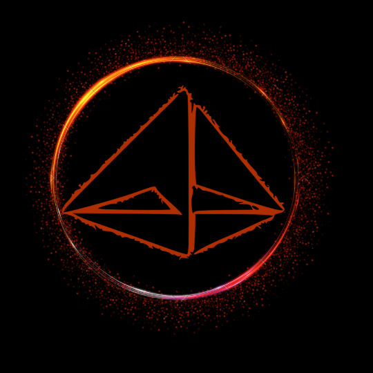

    
    <h1 align="center">CHILLBACK</h1>

	
	
	
    
    

    <em>Here are some of the key technologies used in this project</em>

    
	
    
	
	
	
	
	
    

## 🔗 Quick Links

> - [📍 Overview](#-overview)
> - [📦 Features](#-features)
> - [🤝 Contributing](#-contributing)
> - [📄 License](#-license)

## 📍 Overview

Chillback is an open-source music player built for those who prioritize a relaxed listening experience. Unlike resource-hungry options, Chillback is designed for smooth and efficient performance, making it ideal for users who value battery life or lower-powered devices. Packed with a modern, customizable UI, Chillback empowers you to tailor the player to your preferences, offering a compelling alternative to Spotify.

## 📦 Features

- TODO 

## 🤝 Contributing

Contributions are welcome! Here are several ways you can contribute:

- **[Submit Pull Requests](https://github.com/Deaths-Door/Chillback/blob/main/CONTRIBUTING.md)**: Review open PRs, and submit your own PRs.
- **[Join the Discussions](https://github.com/Deaths-Door/Chillback/discussions)**: Share your insights, provide feedback, or ask questions.
- **[Report Issues](https://github.com/Deaths-Door/Chillback/issues)**: Submit bugs found or log feature requests for Chillback.
---

## 📄 License

This project is protected under the [MIT License](https://opensource.org/license/mit) License. For more details, refer to the [LICENSE](https://github.com/Deaths-Door/Chillback/blob/main/LICENSE) file.
